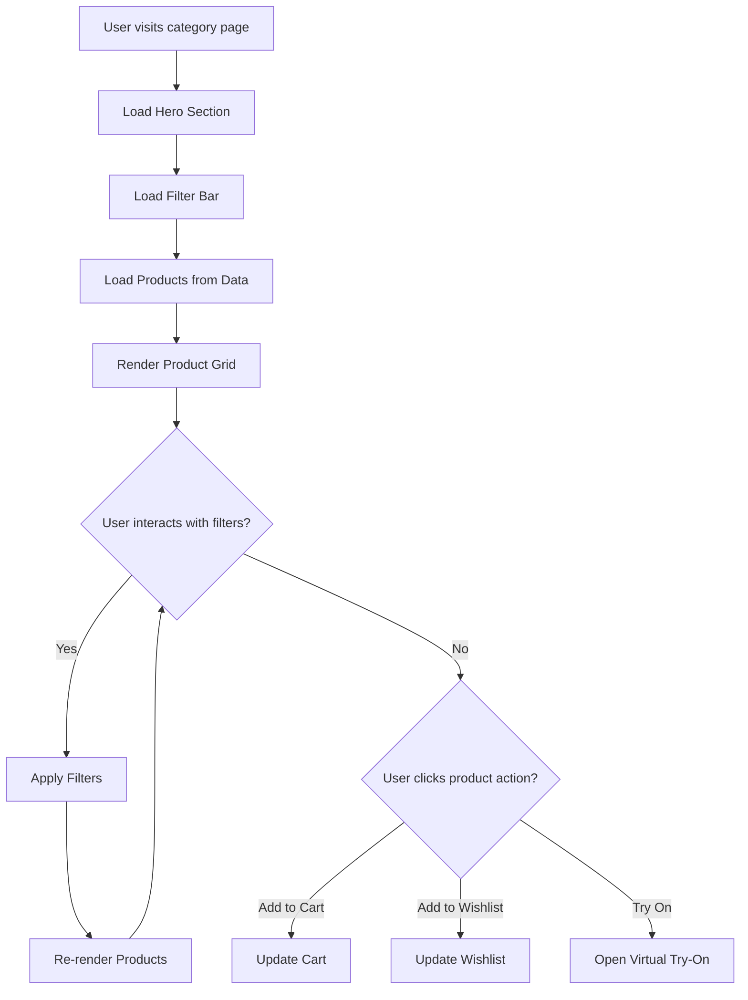
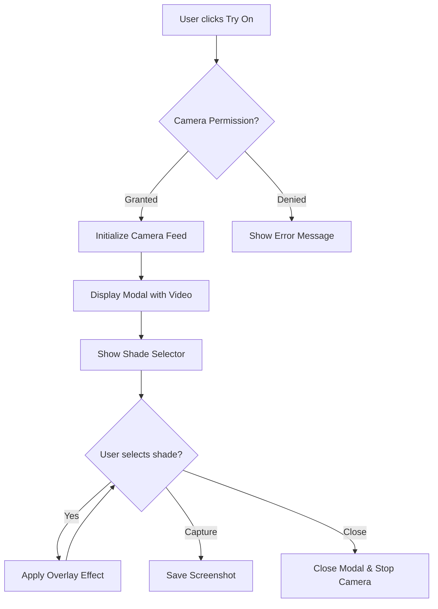
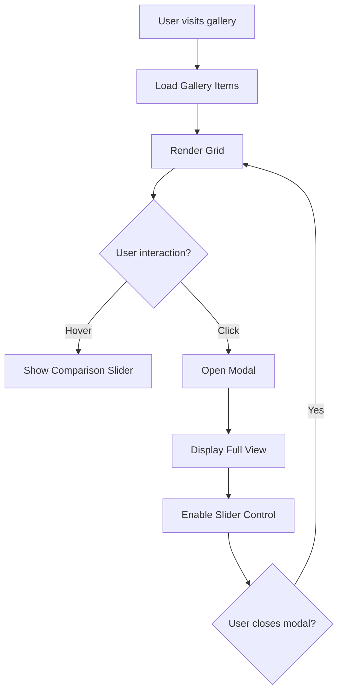

# Design Document

## Overview

هذا التصميم يحدد البنية التقنية لتطوير صفحات الفئات الفرعية لمتجر Glamour لمستحضرات التجميل. يتضمن التصميم أربع صفحات فئات (العناية بالبشرة، المكياج، العناية بالشعر، العطور)، ميزة التجربة الافتراضية، معرض قبل وبعد، ومدونة الجمال.

## Architecture

### File Structure

```
demos/cosmetics/
├── index.html              # الصفحة الرئيسية (موجودة)
├── style.css               # الأنماط الرئيسية (موجودة)
├── script.js               # السكريبت الرئيسي (موجود)
├── category.css            # أنماط صفحات الفئات (جديد)
├── category.js             # سكريبت صفحات الفئات (جديد)
├── skincare.html           # صفحة العناية بالبشرة (جديد)
├── makeup.html             # صفحة المكياج (جديد)
├── haircare.html           # صفحة العناية بالشعر (جديد)
├── fragrance.html          # صفحة العطور (جديد)
├── virtual-tryon.html      # صفحة التجربة الافتراضية (جديد)
├── virtual-tryon.css       # أنماط التجربة الافتراضية (جديد)
├── virtual-tryon.js        # سكريبت التجربة الافتراضية (جديد)
├── before-after.html       # صفحة معرض قبل وبعد (جديد)
├── before-after.css        # أنماط معرض قبل وبعد (جديد)
├── before-after.js         # سكريبت معرض قبل وبعد (جديد)
├── blog.html               # صفحة المدونة (جديد)
├── blog.css                # أنماط المدونة (جديد)
└── blog.js                 # سكريبت المدونة (جديد)
```

### Design Pattern

سيتم اتباع نفس النمط المستخدم في قسم Electronics:
- صفحات HTML منفصلة لكل فئة
- ملف CSS مشترك للأنماط
- ملف JavaScript مشترك للوظائف مع بيانات المنتجات

## Components and Interfaces

### 1. Category Page Component

```
CategoryPage {
    hero: HeroSection
    filters: FilterBar
    products: ProductGrid
    footer: Footer
}

HeroSection {
    backgroundImage: string
    icon: SVGElement
    title: string
    description: string
    backLink: Link
}

FilterBar {
    brandFilter: SelectDropdown
    priceFilter: SelectDropdown
    sortFilter: SelectDropdown
}

ProductGrid {
    products: ProductCard[]
}

ProductCard {
    id: number
    name: string
    brand: string
    image: string
    oldPrice: number (optional)
    price: number
    specs: string[]
    rating: number
    reviews: number
    badge: string (optional)
    badgeType: 'new' | 'bestseller' | 'sale'
}
```

### 2. Virtual Try-On Component

```
VirtualTryOn {
    cameraFeed: VideoElement
    productSelector: ProductShadeSelector
    captureButton: Button
    closeButton: Button
}

ProductShadeSelector {
    shades: Shade[]
    selectedShade: Shade
}

Shade {
    id: number
    name: string
    color: string
    overlayImage: string (optional)
}
```

### 3. Before & After Gallery Component

```
BeforeAfterGallery {
    items: GalleryItem[]
    modal: GalleryModal
}

GalleryItem {
    id: number
    beforeImage: string
    afterImage: string
    productName: string
    category: string
    testimonial: string
    userName: string
}

GalleryModal {
    currentItem: GalleryItem
    slider: ComparisonSlider
}

ComparisonSlider {
    position: number (0-100)
    beforeImage: string
    afterImage: string
}
```

### 4. Beauty Blog Component

```
BeautyBlog {
    posts: BlogPost[]
    categories: string[]
    activeCategory: string
}

BlogPost {
    id: number
    title: string
    excerpt: string
    content: string
    featuredImage: string
    category: string
    date: string
    author: string
    readTime: string
}
```

## Data Models

### Products Data Structure

```javascript
// Skincare Products
const skincareProducts = [
    {
        id: number,
        name: string,
        brand: string,           // 'Dior', 'Chanel', 'La Mer', etc.
        image: string,
        oldPrice: number | null,
        price: number,
        specs: string[],         // ['50ml', 'مرطب', 'للبشرة الجافة']
        rating: number,          // 1-5
        reviews: number,
        badge: string | null,    // 'جديد', 'الأكثر مبيعاً', '-20%'
        badgeType: string        // 'new', 'bestseller', 'sale'
    }
];

// Similar structure for:
// - makeupProducts
// - haircareProducts
// - fragranceProducts
```

### Before & After Data Structure

```javascript
const beforeAfterData = [
    {
        id: number,
        beforeImage: string,
        afterImage: string,
        productName: string,
        category: string,        // 'skincare', 'makeup', 'haircare'
        testimonial: string,
        userName: string,
        duration: string         // 'بعد 4 أسابيع'
    }
];
```

### Blog Posts Data Structure

```javascript
const blogPosts = [
    {
        id: number,
        title: string,
        excerpt: string,
        content: string,
        featuredImage: string,
        category: string,        // 'skincare-tips', 'makeup-tutorials', 'haircare'
        date: string,
        author: string,
        readTime: string         // '5 دقائق'
    }
];
```

## Error Handling

### Camera Access Errors (Virtual Try-On)

```javascript
// Handle camera permission denied
IF camera permission denied THEN
    Display error message: "يرجى السماح بالوصول للكاميرا لاستخدام هذه الميزة"
    Show instructions for enabling camera access

// Handle no camera available
IF no camera device found THEN
    Display error message: "لم يتم العثور على كاميرا"
    Suggest using device with camera
```

### Product Loading Errors

```javascript
// Handle empty product list
IF products array is empty THEN
    Display message: "لا توجد منتجات في هذه الفئة"

// Handle filter with no results
IF filtered products is empty THEN
    Display message: "لا توجد منتجات مطابقة للبحث"
    Show button to reset filters
```


## Correctness Properties

*A property is a characteristic or behavior that should hold true across all valid executions of a system-essentially, a formal statement about what the system should do. Properties serve as the bridge between human-readable specifications and machine-verifiable correctness guarantees.*

### Property 1: Brand Filter Correctness

*For any* category page (skincare, makeup, haircare, fragrance) and *for any* brand selection, all displayed products SHALL have a brand property that matches the selected brand filter value.

**Validates: Requirements 1.4, 2.4, 3.4, 4.4**

### Property 2: Price Range Filter Correctness

*For any* category page and *for any* price range selection (min, max), all displayed products SHALL have a price property that satisfies: min <= price <= max.

**Validates: Requirements 1.5, 2.5, 3.5, 4.5**

### Property 3: Sort Order Correctness

*For any* category page and *for any* sort option selection:
- If "price-low" is selected, products SHALL be ordered such that product[i].price <= product[i+1].price for all i
- If "price-high" is selected, products SHALL be ordered such that product[i].price >= product[i+1].price for all i

**Validates: Requirements 1.6, 2.6, 3.6, 4.6**

### Property 4: Gallery Item Information Completeness

*For any* gallery item in the Before & After Gallery, the rendered item SHALL contain: productName, category, and testimonial fields that are non-empty strings.

**Validates: Requirements 6.3**

### Property 5: Blog Post Information Completeness

*For any* blog post displayed in the Beauty Blog, the rendered post SHALL contain: date, category, and excerpt fields that are non-empty strings.

**Validates: Requirements 7.2**

### Property 6: Blog Category Filter Correctness

*For any* category selection in the Beauty Blog, all displayed posts SHALL have a category property that matches the selected category filter value.

**Validates: Requirements 7.5**

### Property 7: Cart Count Increment

*For any* product added to cart from any category page, the cart count SHALL increase by exactly 1 (or quantity if already exists).

**Validates: Requirements 8.4**

## Testing Strategy

### Unit Tests

Unit tests will verify specific examples and edge cases:

1. **Page Load Tests**: Verify each category page loads with correct elements
2. **Filter UI Tests**: Verify filter dropdowns exist and have correct options
3. **Product Count Tests**: Verify correct number of products displayed
4. **Error Handling Tests**: Verify error messages display correctly
5. **Navigation Tests**: Verify links work correctly

### Property-Based Tests

Property-based tests will use a JavaScript testing framework (e.g., fast-check with Jest) to verify universal properties:

1. **Filter Properties**: Generate random filter combinations and verify results
2. **Sort Properties**: Generate random product lists and verify sort order
3. **Data Completeness Properties**: Generate random data and verify all required fields present

### Test Configuration

- Minimum 100 iterations per property test
- Each property test must reference its design document property
- Tag format: **Feature: cosmetics-category-pages, Property {number}: {property_text}**

### Testing Tools

- **Jest**: JavaScript testing framework
- **fast-check**: Property-based testing library for JavaScript
- **Testing Library**: For DOM testing

## Mermaid Diagrams

### Category Page Flow



### Virtual Try-On Flow



### Before & After Gallery Flow


